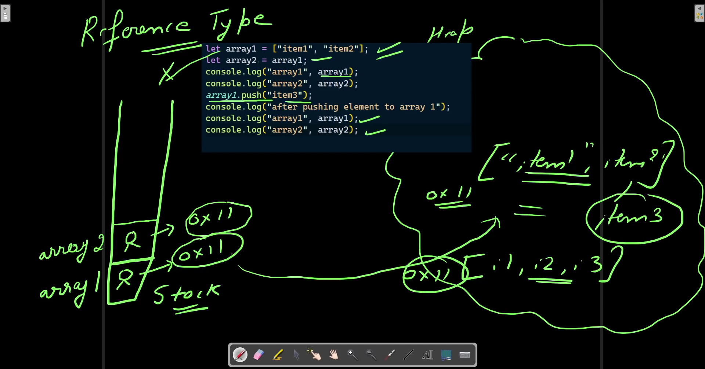

### History of JavaScript ###
Netscape Navigator (1995) - Brendan Eich created Javascript in 10 days which he named to mocha and later on LiveScript.This was done in order to increase the interactivity with the browser. It was not getting popular as expected so at that time java was very popular so he renamed it to JavaScript.

In 1996, Internet Explorer felt something to be done realising that Netscape Navigator was getting popular due to JavaScript. So they copied down some more features of Javascript, added some and named it to Jscript.

So now we have 2 languages and when people started using and found that some website were found to be good and more better when used with particular language like JavaScript or Jscript.
So it was decided to take this issue to ECMA and then ECMA provided some particular standards to be followed by each and every browser while launching any language or any modification in any language and named this documentation to as ECMAScript.

Then came some versions of ECMA's - ES1, ES2 , ES3, ES4. Then came ES5 in 2009 which made JavaScript more popular as compared to the JS in 1995. A major update came in 2015, after which javascript came into the use of majority of people. And then it was decided by a community tc39 that now there will be a update in the history of Javascript every year from now onwards so the versions were like : ES2015, ES2016 so that people will find it easier to get to know that what update has came and in which year. tc39 decides only that what features they should incorporate in JavaScript and which one not. Any feature that is decided to be incorporated into js must pass out these following checks : Purpose, Entrance Criteria, Acceptance Signifies, Specific Quality, Post Acceptance Changes Expected and Implementation types expected.

JavaScript is backward Compatible and not forward compatible which means thatif any person comes up and try to use the new functionalities on the older version of browser, it wouldn't work. So the browser must be updated in order to use each and every new functionality of Javascript. For this we can do two things: Either keep the updated version of the browser or we can use babel. Babel is a javascript compiler which transpiles the modern code into the older versions compatible code.

### Variables ###
Variables can store some information that we can use later and also modify it later as per the requirement.

To declare a variable : 
var firstName = "Mamta";

Using a variable :
console.log(firstName);

Change a variable :
firstName :"Mamta Arora"
** Remember that variable is case sensitive
**

Rules for naming a variable :
1. You can't start name with number.
2. You can use only underscore _ or $.
3. Always use camelCase for declaring variables
4. You can't use spaces.

### Difference between var, let & const - ###
var can be redeclared but let and const can not be redeclared once declared.

let firstName = "Mamta";
let firstName = "Mamta Arora"
console.log(firstName)

var myName = "Mamta";
var myName = "Mamta Arora"
console.log(myName);

here line no 38 will print error as let doesn't allow the name of variable to be declared again but var allows to do so. therefore line 42 will print Mamta Arora.

So in order to change the value of existing variable, just write the name of variable and reassign it a new value like as follows : firstName = "Mamta Arora"

In Case of constants, the value assigned it to must remain same as declared once like 
const pi = 3.14
If we try changing its value like pi = 3.15 as we did in case of let, this will give an error - Assignment to a constant variable.

Also block scope VS function scope(discuss later)

### String Indexing and length property ###
String Properties : In Javascript, we have two properties String Indexing and String length.

For Eg - let firstName = "Mamta Arora";
console.log(firstName[1]); //a
console.log(firstName.length); //11

To find the last alphabet of the string we will use it like :
console.log(firstname[firstName.length-1]); //a

### String Methods ###
Since Strings are immutable they are not changed on their own. if we use any string method then we need to store in the different variable and then we can use it. Variable to store the changed string can be of same name or it can be different. There are some string methods as follows :
1.trim() - removes extra space from left and right.

2.toUpperCase() - converts the string alphabets into capital letters.

3.toLowerCase() - converts the alphabets of string in small letters.

4.slice() - cuts the string. Syntax - StringName.slice(startIndex, EndIndex) or StringName.slice(startIndex)

### Data Types ###
// typeOf operator - used to check the data type of a variable.

Primitive data types:
String - "harshit"
number - 23
booleans - true or false
undefined - when variable is declared but is not assigned with any value. For Eg - let firstname; valid in case of let and var but in const it gives error.
null
BigInt - to store a big integer value
Symbol

Conversion of String to Number - Add + or Number before the variable value.

Conversion of Number to String - Add String before the variable value or add + "" after the variable value

String Concatenation - Refer to (09StringConcatenation.js).

Template String - Refer to [Template String](10TemplateString.js)

### Difference bw == & === ###
== checks for the value only, if the value of both the variables is same, then it will return true and will not check for data type. === checks for both value as well as data type. === will return true if both the data type and value is same.

*Note :  All values except 0, false, "", undefined, null are truthy values
*

if-else operator - [if-else](14ifElse.js)

Ternary Operator - [ternary operator](15TernaryOperator.js)

& and || Operator - [And & Or Operator](16AndOrOperator.js)

nested if-else - [nested if-else](17nestedIfelse.js)

if else-if - [if else-if](18ifElseIf.js)

switch statement - [Switch](19switch.js)

While Loop - [While Loop](20WhileLoop.js)

For Loop - [For Loop](22forLoop.js)

Break And Continue [Example](24break&Continue.js)

Do-while Loop [Do While Loop](25doWhileLoop.js)

### Arrays ###
Arrays are reference type and these are ordered collection of items. Ordered means they are in an order means these array do have an index.Arrays can store any datatype. It can be mixture of string and numbers even.

All the reference type are objects. So here array being reference type will be Object. So (typeOf Array) will be object

If you need to verify whether the declared reference type is array or not we can use Array.isArray(nameOfArray). So if it will be an array it will return true.

Note - Arrays are mutable like if we perform any modification later on, it will change the original array.

### Array Methods ###
1.push - adds the element at last.
2.pop - removes the element from the last. Also it gives the element that has been popped out.
3.shift - removes the element from the first index of Array.
4.unshift - Adds the element at the first index of Array.

### Primitive Vs Reference Data Types: 

In case of Primitive data types the address of value stored is not same whereas in case of reference data types the address pointing in heap memory is same. That's why the other value get updated as shown below in the picture

When you assign a simple value like a number or a string to a variable, it behaves differently compared to assigning an array or an object.
In JavaScript, primitive values (such as numbers, strings, booleans, null, and undefined) are assigned by value. This means that when you assign a primitive value to a variable, you are creating a new copy of that value in memory. Let's consider an example:
javascript

let var1 = 1; let var2 = var1; console.log(var1 == var2); // Output will be true 
In this case, var1 and var2 will have the same value 1, but they will be independent copies of that value. So, var1 == var2 returns true because they have the same value.
Similarly, for strings or other primitive types, the assignment creates separate copies, and the comparison using == will evaluate to true if they have the same value.
It's important to note that when comparing primitive types using ==, JavaScript checks for equality of values. However, for objects and arrays, == checks for equality of references (i.e., if they point to the same memory location) rather than the equality of values inside them. For comparing objects or arrays based on their values, it's better to use the JSON.stringify() method or custom comparison functions.

### How to Clone an Array ###
There are following ways to copy or clone array - 
1.Just copy and paste same array values into another array variable - refer [ Methods ](29MoreOnArrays.js)
2.we can also use slice in order to copy the array values like newArray = ArraytobeCloned.slice(0).
3.[].concat is used to make a new array by concating with older one.
4. New Way - spread operator like this let array2 = [...array1].

Out of these best performance is provided by slice method. Also we can use spread operator and push more items in one array in order to get a new array like this - let array2 = [...array1, "item2", "item3"] or let array2 = array1.slice(0).concat(["name4","name5"]);

Array Properties include length also as we have in String. It is like ArrayName.length

For Loop in arrays - [Example](30ArrayForLoop.js)

### Can we use const while using arrays? ###
Yes, we must use const while declaring the arrys because arrays are reference type data type. Therefore the array is stored in heap memory. So using const with arrays is not creating any problem because we are not changing the address to which it is SVGTextPositioningElement. We are just adding items to an existing array with some memory address.

While Loop in Arrays - [Example](32ArrayWhileLoop.js)

for-of Loop - [Example](33forOfLoop.js)

for-in Loop - [Example](34forInLoop.js)

### Array Destructuring ###
Array Destructuring makes it possible to unpack values from arrays, or properties from objects, into distinct variables.It helps to convert the different values of an array into unique variables [Refer here for eg](35ArrayDestructuring.js)

Array Destructuring can be done at variables as well as arrays can be destructured in another array.[Refer here for eg](35ArrayDestructuring.js)

### Objects ###
Arrays are not enough to store real world data so Objects are used for real world data.Objects are refrence type and they don't have index. These can store key value pairs.

Dot Vs Bracket Notation
We can use both . and [] in order to access the property of the object but if we have a key separated by a space, then we can't use dot notation in order to access the object property.That's why we need to use bracket notation like objectName["propertyName"].

Also in case when we have to insert a property in an object by its value then bracket notation is very useful like -
const key = "email"
person[key]="mamtaroraksh@gmail.com";
console.log(person);

### Object Iteration ###
In order to iterate the object , we can use for-in loop or Object.keys.

1. for-in loop - [Refer here](38objectIteration.js)

2. Object.keys - [Refer here](38objectIteration.js)

Computed Properties - Computed properties are used when we want to take the value of variable as a key of object.[Example](39ComputedProperties.js).

### Spread Operators ###
In case of arrays, it simply separates/spreads the values of array and if we use ... against a string it will also spread that string. For eg - ..."mamta" - It will give output as follows : ['m', 'a', 'm', 't', 'a']

In case of objects, spreading of onject is similar to the spread of an array except the fact that that spreading woul be done in form of key and value pair in objects. If we use ... against a string it will also spread that string in key value form by giving index of alphabet as key and value as single alphabet. For example - "obj1" would be spreaded as {0: 'o', 1: 'b', 2: 'j', 3: '1'} in case of objects.

In case of array inside object,it will give start giving index to key and value inside array as value of object. If there are 2 items in array inside object, {...["name1", "name2"]} it would spreaded as - {0: 'name1', 1: 'name2'}

### Object Destructuring ###
[Refer here for Object Destructuring](41objectDestructuring.js)

Object inside arrays - most useful
We can use any loop that we can use on array in order to iterate the objects inside an array. [Object Inside Arrays](42objectinsideArray.js)

in order to fetch the data from array inside objects we can use [Nested Destructuring](43nestedDestructuring.js)

### FUNCTIONS ###
functions can be of following types : 
1. simple functions - function funName(){
    //code
}
2.Function Expression - Basically we will store the function in a variable as follows - const functionName = function(){
    //code
}
functionName()
3.Arrow function = const varName = () =>{
    //code
}
function koi bhi tarah se create karo ek function ko different methods se nahi bana skte ek hi file mein matlab ek hi function ho aur use teeno methods se bnado, this will give error.

### Hoisting ###
Normally in other languages we cannot use a function before declaring it but js allows writing a function call before we declare it. This is known as hoisting. This is possible only in simple function declaration and not in case of function expression.[More abou hoisting](48funcInsidefunc.js)

### lexical Scope ###
lexical scope refers to the ability of a function scope to access variables from the parent scope. When there is lexical scope, the innermost, inner and outermost functions may access all variables from their parent scopes all the way up to the global scope.[Example](49lexicalScope.js)

### block scope vs function scope
let and const are block scope while var has functional scope. [Examples](50blockvsfunctionscope.js)

### Array Methods ###
1.forEach() - Takes a callback function and iterate through each element of array. 
Syntax - arrayName.forEach(function(currentValue, index, arr), thisValue)

2.Map() - Takes a callback function and iterate through each item of array.
The only difference bw forEach and map is that map returns the new array we can't directly get the output so whatever map returns we need to first store it somewhere in order to get the output. Map binds the output into an array and foreach just gives the output as a value. If we use return with foreach the output would be undefined.

for Eg -
const users = [
    {userId: 1, firstName: "Mamta", gender:"female"},
    {userId: 2, firstName: "Ishita", gender:"female"},
    {userId: 3, firstName: "Nandini", gender:"female"},
    {userId: 4, firstName: "Gupta", gender:"female"}
];
In case of foreach - It will give output as : Mamta Ishita Nandini Gupta
In case of map - It will give output as : ['Mamta', 'Ishita', 'Nandini', 'Gupta']

3.reduce() - reduce() method in JavaScript is used to reduce the array to a single value and executes a provided function for each value of the array (from left to right) and the return value of the function is stored in an accumulator. [Example](59reduce.js). Also when we want to pass the initial value to the accumulator, then after the callback we can put a comma and write the value say 0.
const total = userCart.reduce((totalPrice, currentProduct)=>{
    return totalPrice + currentProduct.price
},0)

4.sort() - In order to sort the numbers in ascending or descending order, we must take two parameters in callback and check whether their difference is positive or negative. In case of ascending order if we get a-b >0 (positive) then it will swap the numbers otherwise will remain as it is. In case of descending order we will return b-a instead of a-b baaki case for swapping is vice versa. [Example](60sort.js).

5.find() - is used to find the element in an array which matches a particular condition. It is similar to the filter method but it will return only the first occurence matching that particular condition. All the other items in the array that matches the condition will not be printed. find() is used for the single item search only. We cant use map after the find method because it returns only the single object.[Example](61find.js)

6.every() - is used to check whether all the elements in the array fulfill the condition. If yes, then it will return true otherwise false and if there will be even a single item not matchiing the condition in the array, then it will return false. every() just returns either return true or false.[Example](62every.js)

7.some() - returns true if even one single item matches the array otherwise false.[Example](63some.js)

8.fill() - is used to fill an array with a number from a particular start index to particular end. Syntax - arrayName.fill(value, start, end);

9.splice() - is used to add or delete items from an array on a particular position. It changes the original array. Syntax - arrayName.splice(positionToStart, deleteIndex, valueToBeInserted). Slice returns the changed items or modified items.

### Iterables ###
Iterables are those which can be iterated over with for-of loop. for example - a string - "Mamta" . This can be iterated using for-of loop and will give some output as follows - M a m t a. Also array is iterable because it can be iterated using for-of loop.

Can we do the same on Object as well ?
No object is not iterable.

Array like objects are those which have index and has length property.
String is also array like object as it has index and length property.

More Iterables : 
Sets -  are used to store the data and it have its own methods. There is no index based access over here and order is not guaranteed. Also it doesn't allow duplicates and containes unique values only. 

To create a set we will use - const setName = new Set(Iterable inside whether array or some other iterable)
.

Map - This Map is different from map we used in the array method. This is an iterable and stores data in ordered fashion. Map can store the data in the form of key and value pair (like object). Duplicate keys are not allowed as in objects. 

The difference between maps and Objects is objects can only have a string or symbol as key. In maps we can use anything as key like array , number or string

>Note - When we try to access the properties which may not be present in the object then we should use optional chaining(?.) in order to avoid the error and get undefined as the result. This proceeds if the first element is present only otherwise it would say undefined and stops there only.[Example](70OptionalChaining.js)

This Keyword - this keyword refers to an object. It is object depends on how it is used like - 

In an object method, this refers to the object.
Alone, this refers to the global object.
In a function, this refers to the global object.
In a function, in strict mode, this is undefined.
Methods like call(), apply(), and bind() can refer this to any object.

### Call, Apply and Bind ###
call - This method is used when we want to call the same function but with multiple objects. In case of call, it invokes a function and we can pass a list of arguments. 

Eg - suppose we have a method and we want to use it with different objects then we can simply write -
nameOffunction.call(objectTobeusedWith);
[refer to this Example](73call-bind-apply.js)

apply - it is same as call but we need to pass the arguments as an array.

bind - Working of bind is same as call, we have to pass the arguments as a list but it returns the new function which need to be stored and then to be called again

>Note - Arrow functions dont have this, they consider this one step above the actual call.

Creating Functions in order to create multiple objects - 
It is very difficult to make a single single object so we can create a single function and use it again in order to avoid code repetition as done in  [this one](75creatingFunctionstocreateMultipleObjects.js)

Object.create mein jo bhi object hum pass karte hain, that will be a kind of reference or yeh __proto__ ke andar save hojata hai , agar koi property missing hoti hai new object mein toh it will start finding in the proto object. It can be written as -__proto__ or [[prototype]]. [[prototype]] is acc to ecmascript documentation.[Example](78object.create.js)

> Note: __proto__ and [[prototype]] is one and same thing but prototype is different. Prototype -  When we create a new function, it gives us some free space known as prototype which is an object.Prototype is only present in function and not in object and variable. Also we can add the properties through prototype

new keyword - 
1. creates an empty object firstly
2. return this
3. also ye khud se as prototype mein added properties ko bhi add kardega 
const user = Object.create(createUser.prototype); We dont need to do this 

Class - Classes are a template for creating objects. They encapsulate data with code to work on that data. [Example](84class.js)

Static Methods & Properties - These are similar to the normal methods and properties except the fact, that we use static keyword ahead of method name or the property name. Also We can access the method and property through class name directly.